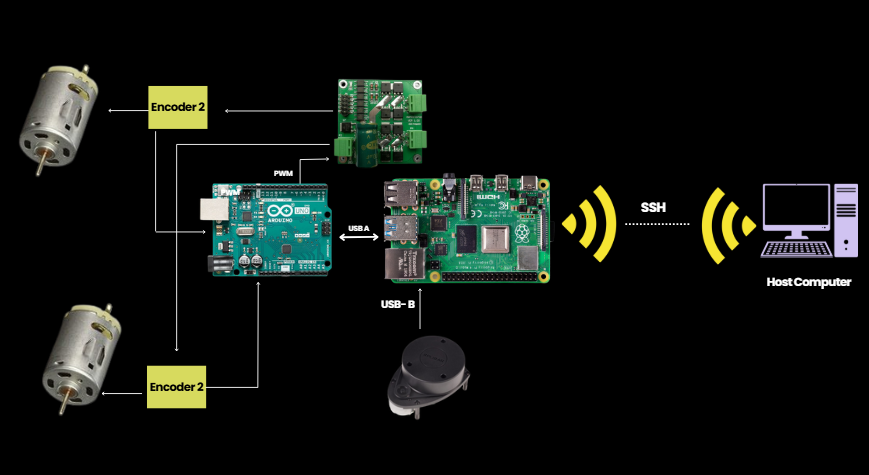

# Autonomous SLAM-Based Interactive Robot

## Overview
This project focuses on developing an **Autonomous SLAM-Based Assistive Robot** with autonomous navigation and interaction capabilities. The robot is designed to assist users in various environments by utilizing SLAM (Simultaneous Localization and Mapping) and interactive features.

<div align="center">
  
</div>

## Features
- **SLAM-based localization** using **RPLIDAR A1** and **SLAM Toolbox**.
- **Navigation and path planning** using **ROS2 Navigation Stack (Nav2)**.
- **Interactive capabilities** via **robot face animations**.
- **Integration with articulated robotics in ROS Humble**.
- **Modular and expandable design** for future improvements.


## Implementation Details
### Interaction Ability
- Robot features **animated face expressions** for interactive communication.
- Future scope includes **gesture response**.
- We leverage the **Viam OpenAI Integration Tutorial** for voice interaction.
🔗 [Viam OpenAI Integration](https://github.com/viam-labs/tutorial-openai-integration/tree/main)

### SLAM and Localization
- Implemented using **RPLIDAR A1** and **SLAM Toolbox** in **ROS2 Humble**.
- Odometry is fused with LiDAR scans for accurate localization.
- Visualization in **Rviz2** for live mapping.

### Navigation
- Uses **ROS2 Nav2** stack for path planning and obstacle avoidance.
- Differential drive controlled via **Arduino + Motor Driver**.
- Teleoperation node allows manual testing via keyboard 

## Hardware Setup
- **Custom Assistive Robot Frame** (Image shown below)
- **RPLIDAR A1** for mapping and localization
- **Embedded computing unit** for real-time processing
- **Sensors and actuators** for interactive movement

This architecture shows the **hardware connections** between the motors, encoders, Arduino, Raspberry Pi, LiDAR, and host computer.

<div align="center">
  
</div>

## Dependencies
- **Python** 
- **ROS Humble** (for robotics testing)
- **Viam SDK & APIs**
- **RPLIDAR A1 drivers**

  The software stack leverages **ROS2**, **SLAM Toolbox**, and **Rviz2** for mapping, navigation, and teleoperation.

<div align="center">
  
</div>

## Future Improvements
- Multi-modal perception (camera + audio)
- Voice commands and speech response
- Power optimization and autonomous docking

## Authors
Khadeeja Khan, Hassaan Muhammad Khan, Narmeen Sabah Siddiqui, Abdul Rafey Beig
Final Year Electrical Engineering Students, NUST'25

## Installation & Setup
1. Clone the repository:
   ```sh
   git clone https://github.com/Hassaanmk/Autonomous-SLAM-Based-Assistive-Robot.git
   cd Autonomous-SLAM-Based-Assistive-Robot
